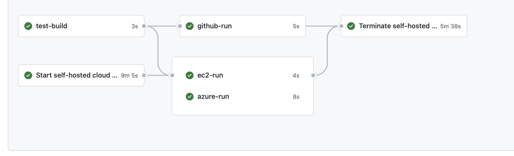

# On-demand self-hosted AWS EC2 and Azure runner for GitHub Actions

This roject is loosely based on ec2-github-runner by Volodymyr Machula.
Start your EC2, Azure or both  [self-hosted runner](https://docs.github.com/en/free-pro-team@latest/actions/hosting-your-own-runners) right before you need it.
Run one or more jobs on it.
Finally, stop it when you finish.



See [below](#example) the YAML code of the depicted workflow. <br><br>

**Table of Contents**

- [Use cases](#use-cases)
  - [Start EC2 Runner ](#start-ec2-runner)
  - [Start Azure Runner](#start-azure-runner)
  - [Save costs](#save-costs)
- [Usage](#usage)
  - [How to start](#how-to-start)
  - [Inputs](#inputs)
  - [Outputs](#outputs)
  - [Example](#example)
  - [Real user examples](#real-user-examples)
- [Self-hosted runner security with public repositories](#self-hosted-runner-security-with-public-repositories)
- [License Summary](#license-summary)

## Use cases

### Start EC2 Runner


The action will check if specified VPC exists. If it does, your intance will be started in that VPC and use all resourses availabel in that VPC. If not, a new VPC with all the minimal necessary configurations will be created before starting your instance.  

If you creatign a new VPC, it will be left in your account for re-use

### Start Azure Runner

The action will create Resourse group and all necessary resourses to start and run Virtual machine. 

### Save costs

> Self-hosted runners are free to use with GitHub Actions, but you are responsible for the cost of maintaining your runner machines.

So you will be charged by GitHub only for the time the self-hosted runner start and stop.
EC2 self-hosted runner will handle everything else so that you will pay for it to AWS, which can be less expensive than the price for the GitHub-hosted runner.

## Usage

### How to start

Use the following steps to prepare your workflow for running on your EC2 self-hosted runner:

**1. Prepare IAM user with AWS access keys**

1. Create new AWS access keys for the new or an existing IAM user with the following least-privilege minimum required permissions:

   ```
   {
     "Version": "2012-10-17",
     "Statement": [
       {
         "Effect": "Allow",
         "Action": [
           "ec2:RunInstances",
           "ec2:TerminateInstances",
           "ec2:DescribeInstances",
           "ec2:DescribeInstanceStatus"
         ],
         "Resource": "*"
       }
     ]
   }
   ```

   If you plan to attach an IAM role to the EC2 runner with the `iam-role-name` parameter, you will need to allow additional permissions:

   ```
   {
    "Version": "2012-10-17",
    "Statement": [
      {
        "Effect": "Allow",
        "Action": [
          "ec2:ReplaceIamInstanceProfileAssociation",
          "ec2:AssociateIamInstanceProfile"
        ],
        "Resource": "*"
      },
      {
        "Effect": "Allow",
        "Action": "iam:PassRole",
        "Resource": "*"
      }
    ]
   }
   
   These example policies above are provided as a guide. They can and most likely should be limited even more by specifying the resources you use.

2. Add the keys to GitHub secrets.


**2. Prepare GitHub personal access token**

1. Create a new GitHub personal access token with the `repo` scope.
   The action will use the token for self-hosted runners management in the GitHub account on the repository level.
2. Add the token to GitHub secrets.

**3. Prepare image(s)**

1. For EC2 runner creat AMI or select an esisteng public one.
2. For Azure prepare Image or select one in teh format ResourceGroupName:ImageName

**5. Configure the GitHub workflow**

1. Create a new GitHub Actions workflow or edit the existing one.
2. Use the documentation and example below to configure your workflow.
3. Please don't forget to set up a job for removing the EC2 instance at the end of the workflow execution.
   Otherwise, the EC2 instance won't be removed and continue to run even after the workflow execution is finished.

Now you're ready to go!

### Inputs

| &nbsp;&nbsp;&nbsp;&nbsp;&nbsp;&nbsp;&nbsp;&nbsp;&nbsp;&nbsp;&nbsp;&nbsp;&nbsp;&nbsp;Name&nbsp;&nbsp;&nbsp;&nbsp;&nbsp;&nbsp;&nbsp;&nbsp;&nbsp;&nbsp;&nbsp;&nbsp;&nbsp;&nbsp; | Required                                   | Description                                                                                                                                                                                                                                                                                                                           |
| ---------------------------------------------------------------------------------------------------------------------------------------------------------------------------- | ------------------------------------------ | ------------------------------------------------------------------------------------------------------------------------------------------------------------------------------------------------------------------------------------------------------------------------------------------------------------------------------------- |
| `cloouds`                                                                                                                                                                       | Optional. Defaults to 'both'                           | Specify here which runner you want to start: <br> - `ec2` - to start ec2 runner only; <br> - `azure` - to start Azure runner only; <br> `both` - to start both.                                                              |
| `mode`                                                                                                                                                                       | Always required.                           | Specify here which mode you want to use: <br> - `start` - to start a new runner; <br> - `stop` - to stop the previously created runner.                                                                                                                                                                                               |
| `status`                                                                                                                                                                       | Required for stop mode required.                           | ${{ toJSON(needs)}                                                                                                                                                                                               |
| `github-token`                                                                                                                                                               | Always required.                           | GitHub Personal Access Token with the `repo` scope assigned.                                                                                                                                                                                                   |
| `subnet`                                                                                                                                                                  | Required if you use the `start` mode.      |  Subnet in format N.N.N.N                                                                                                                                                                                                                                     |
| `runner-user`                                                                                                                                                                  | Required if you use the `start` mode.      | Linux user to run as                                                                                                                                                                                                                                      |
| `public-keys-dir`                                                                                                                                                                  | Required if you use the `start` mode.      | Directory thatcontains public keys to be used to used to access instance                                                                                                                                                                                                                                      || `ec2-image`                                                                                                                                                               | Required if you use the `start` mode.      | EC2 Image Name (AMI). <br><br> The new runner will be launched from this image. <br><br> The action is compatible with Amazon Linux 2 images.                                                                                                                                                                                           |
| `ec2-instance-type`                                                                                                                                                          | Required if you use the `start` mode.      | EC2 Instance Type.                                                                                                                                                     |
| `iam-role-name`                                                                                                                                                              | Optional. Used only with the `start` mode. | IAM role name to attach to the created EC2 runner. <br><br> This allows the runner to have permissions to run additional actions within the AWS account, without having to manage additional GitHub secrets and AWS users. <br><br> Setting this requires additional AWS permissions for the role launching the instance (see above). |
| `ec2-tags`                                                                                                                                                          | Optional. Used only with the `start` mode. | Specifies tags to add to the EC2 instance and any attached storage. <br><br> This field is a stringified JSON array of tag objects, each containing a `Key` and `Value` field (see example below). <br><br> Setting this requires additional AWS permissions for the role launching the instance (see above).                         |
| `ec2-access-key-id, ec2-secret-access-key`                                                                                                           | Used only with the `start` mode. | Use your secrets to set up AWS credentials                        |
| `ec2-region`                                                                                                                                                          | Required if you use the `start` mode.      | EC2 Instance Region                                                                                                                                                     |
| `az-subscription-id, az-client-id, az-secret,az-tenant-id`                                                                                                           | Used only with the `start` mode. | Use secrets to set up Azure credentials                        |
| `az-image`                                                                                                                                                          | Required if you starting Azure intance . Used only with the `start` mode. | Name of the image to start VM with in the format <resource_group_name>:<image_name>                         |
| `az-location`                                                                                                                                                          | Required if you starting Azure intance . Used only with the `start` mode. | name of the Azure region                |
| `az-vm-size`                                                                                                                                                          | Required if you starting Azure intance . Used only with the `start` mode. | Size of the Azure Virtual Machine                |

### Outputs

| &nbsp;&nbsp;&nbsp;&nbsp;&nbsp;&nbsp;&nbsp;&nbsp;&nbsp;&nbsp;&nbsp;&nbsp;&nbsp;&nbsp;Name&nbsp;&nbsp;&nbsp;&nbsp;&nbsp;&nbsp;&nbsp;&nbsp;&nbsp;&nbsp;&nbsp;&nbsp;&nbsp;&nbsp; | Description                                                                                                                                                                                                                               |
| ---------------------------------------------------------------------------------------------------------------------------------------------------------------------------- | ----------------------------------------------------------------------------------------------------------------------------------------------------------------------------------------------------------------------------------------- |
| `run-ons`                                                                                                                                                                      | JSON string that contains array of available self-hosted runners 
        <br>{
        <br>  ec2: <github runner label>
        <br>  azure: <github runner label>
        <br>} |
| 
### Example

The workflow showed in the picture above and declared in `do-the-job.yml` looks like this:

```yml
# This is a basic workflow to help you get started with Actions

name: TEST RUN Workflow

# Controls when the workflow will run
on:
  # Triggers the workflow on push or pull request events but only for the main branch
  #push:
  #  branches: [ main ]
  #pull_request:
  #  branches: [ main ]

  # Allows you to run this workflow manually from the Actions tab
  workflow_dispatch:
    inputs:
      run_type:
        description: "Run type: regular or nightly"
        default: "regular"
        required: true

# A workflow run is made up of one or more jobs that can run sequentially or in parallel
jobs:
  # starts  self-hosted runner in Clouds (AWS and AZURE suported for now). Cleanup in the stop-runner.
  start-runner:
    name: Start self-hosted cloud runners
    runs-on: ubuntu-latest
    outputs:
      //ec2-instance-id: ${{ steps.start-cloud-runner.outputs.ec2-instance-id }}
      run-ons: ${{ steps.start-cloud-runner.outputs.run-ons }}
    steps:
      - name: Get public Keys 
        uses: actions/checkout@v2

      - name: Start cloud runners
        id: start-cloud-runner
        uses: kontainapp/ec2-github-runner@ez1
        with:
          mode: start
          github-token: ${{ secrets.GH_TOKEN }}
          runner-user: ubuntu
          subnet: "10.0.0.0"
          public-keys-dir: ${{ github.workspace }}/cloud/ssh
          ec2-access-key-id: ${{ secrets.AWS_ACCESS_KEY_ID }}
          ec2-secret-access-key: ${{ secrets.AWS_SECRET_ACCESS_KEY }}
          ec2-region: "us-east-2"
          ec2-image: 'L0BaseAWSImage'
          ec2-instance-type: "m5.xlarge"
          ec2-vpc-name: 'github-runner'
          ec2-tags: > 
            [
              {"Key": "MyKey 1", "Value": "test-value-1"},
              {"Key": "MyKey 2", "Value": "test-value-2"}
            ]
          az-subscription-id: ${{ secrets.SP_SUBSCRIPTION_ID }}
          az-client-id: ${{ secrets.SP_APPID }}
          az-secret: ${{ secrets.SP_PASSWORD }}
          az-tenant-id: ${{ secrets.SP_TENANT }}
          az-image: "auto-github-runner:L0BaseImage"
          az-location: "westus"
          az-vm-size: "Standard_B1ls"
      
      - name: Setup tmate session
        uses: mxschmitt/action-tmate@v3
 
  test-build:
    # The type of runner that the job will run on
    runs-on: ubuntu-latest

    # Steps represent a sequence of tasks that will be executed as part of the job
    steps:
      # Checks-out your repository under $GITHUB_WORKSPACE, so your job can access it
      - uses: actions/checkout@v2

      # Build test program
      - run: make all
      - run: cp bin/main ./runable
      - uses: actions/upload-artifact@v2
        with:
          name: my-runable
          path: ./runable
          retention-days: 7      

  github-run:
    needs: test-build
    runs-on: ubuntu-latest
    steps:
      - uses: actions/checkout@v2
      - uses: actions/download-artifact@v2
        with:
          name: my-runable   
      - run: chmod +x ./runable
      - run: ./runable "Hello there"

  ec2-run:
    needs: [start-runner, test-build]
    runs-on: ${{ fromJSON(needs.start-runner.outputs.run-ons)['ec2'] }}
    steps:
      - uses: actions/checkout@v2
      - uses: actions/download-artifact@v2
        with:
          name: my-runable  
      - run: cat /etc/os-release
      - run: id 
      - run: chmod +x ./runable
      - run: ./runable "Hello there"

  azure-run:
    needs: [start-runner, test-build]
    runs-on: ${{ fromJSON(needs.start-runner.outputs.run-ons)['azure'] }}
    steps:
      - uses: actions/checkout@v2
      - uses: actions/download-artifact@v2
        with:
          name: my-runable  
      - run: cat /etc/os-release
      - run: id 
      - run: chmod +x ./runable
      - run: ./runable "Hello there"

  # These two steps are to clean up on-demand runner. They work in conjunction with start-runner.
  # Make sure to add dependencies in both "needs" clauses
  stop-runner:
    name: Terminate self-hosted cloud runners
    needs: [start-runner, test-build, ec2-run, azure-run]
    if: always()
    runs-on: ubuntu-latest
    steps:
      - name: Stop cloud runner
        uses: kontainapp/ec2-github-runner@ez1
        with:
          mode: stop
          status: ${{ toJSON(needs) }}
          github-token: ${{ secrets.GH_TOKEN }}
          ec2-access-key-id: ${{ secrets.AWS_ACCESS_KEY_ID }}
          ec2-secret-access-key: ${{ secrets.AWS_SECRET_ACCESS_KEY }}
          ec2-region: "us-east-2"
          az-subscription-id: ${{ secrets.SP_SUBSCRIPTION_ID }}
          az-client-id: ${{ secrets.SP_APPID }}
          az-secret: ${{ secrets.SP_PASSWORD }}
          az-tenant-id: ${{ secrets.SP_TENANT }}

```
## Self-hosted runner security with public repositories

> We recommend that you do not use self-hosted runners with public repositories.
>
> Forks of your public repository can potentially run dangerous code on your self-hosted runner machine by creating a pull request that executes the code in a workflow.

Please find more details about this security note on [GitHub documentation](https://docs.github.com/en/free-pro-team@latest/actions/hosting-your-own-runners/about-self-hosted-runners#self-hosted-runner-security-with-public-repositories).

## License Summary

This code is made available under the [MIT license](LICENSE).
